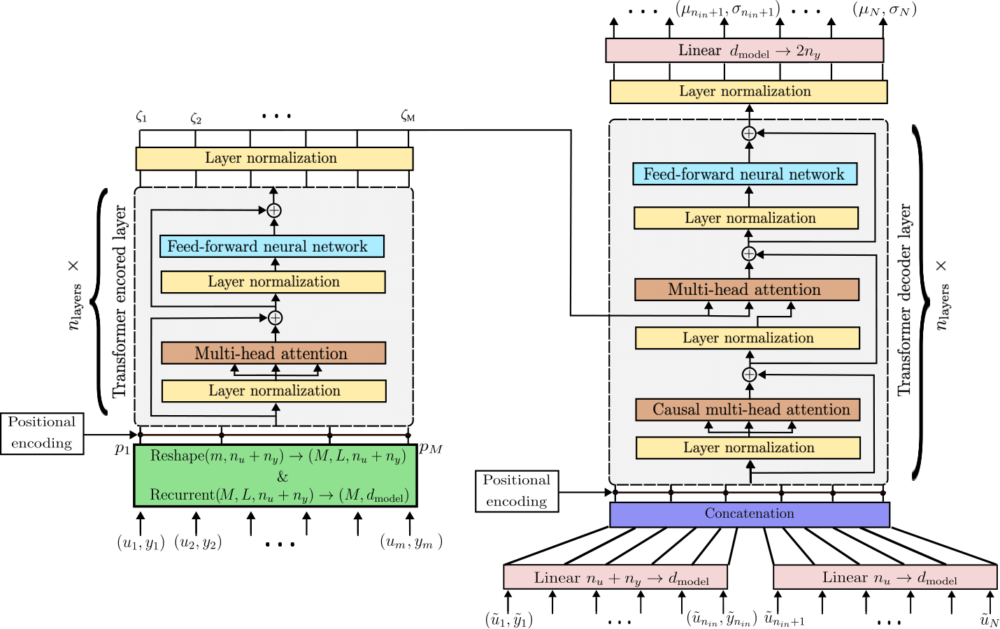

# In-context learning for model-free system identification

<!-- This repository contains the Python code to reproduce the results of the paper [In-context learning for model-free system identification](http://arxiv.org/abs/2308.13380)
by Matteo Rufolo, Dario Piga, Gabriele Maroni, Marco Forgione. -->

One of the author of this repository introduce the concept of model-free in-context learning for System Identification, where a *meta model* is trained to describe an entire class of dynamical systems, all details are written here  [In-context learning for model-free system identification](http://arxiv.org/abs/2308.13380)
In this repository we present the following recent advances in the field: formulating the learning task within a probabilistic framework; presenting two techinques to handle long context sequences (patching and ensembling), showing how the *meta model* can be used to generate sythetic data for classical system identification problems


## Multi-step-ahead model-free simulation

With respect to the original paper we analyze only a multi-step-ahead simulation, using an updated encoder-decoder (machine-translation-like) Transformer architecture:




# Main files

The training are performed on the WH system class, and its script is:

* [train_sim_WH_skip.py](train_sim_WH_skip.py)

The script above accept command-line arguments to customize the architecture and aspects of the training. 

<!-- Trained weights of all the Transformers discussed in the example section of the paper are available as assets in the [v0.3 Release](https://github.com/forgi86/sysid-transformers/releases/tag/v0.3). -->

Jupyter notebooks that load the trained model to test ensambling and patching effectiveness on new data, [test_ensambling.ipynb](test_ensambling.ipynb) for in-distribution analysis and [test_CSTR_patching.ipynb](test_CSTR_patching.ipynb) for testing on a new system class (CSTR), and some recognized non-linear benchmarks ([benchmarks.ipynb](benchmarks.ipynb)).

A more in depth analysis on the CED bechmark through synthetic data is also performed through the [synthetic_CED.py](synthetic_CED.py) script.

# Software requirements
Experiments were performed on a Python 3.11 conda environment with:

 * numpy
 * scipy
 * matplotlib
 * numba
 * pytorch (v2.1.0)
 

These dependencies may be installed through the commands:

```
conda install pytorch -c pytorch
conda install numpy scipy matplotlib
conda install numba::numba
conda install -c conda-forge scikit-learn
```

For more details on pytorch installation options (e.g. support for CUDA acceleration), please refer to the official [installation instructions](https://pytorch.org/get-started/locally/).

The following packages are also useful:

```
conda install jupyter # (optional, to run the test jupyter notebooks)
pip install nonlinear-benchmarks (optional, to run the benchmarks jupyter notebook)
pip install dynonet # (optional, to run the synthetic CED experiment)
pip install wandb # (optional, for experiment logging & monitoring)
```

# Hardware requirements
While all the scripts can run on CPU, execution may be frustratingly slow. For faster training, a GPU is highly recommended.
To run the paper's examples, we used a server equipped with an nVidia RTX 3090 GPU.


# Citing

If you find this project useful, we encourage you to:

* Star this repository :star: 


<!-- * Cite the [paper](https://arxiv.org/abs/2308.13380) 
```
@article{forgione2023from,
  author={Forgione, Marco and Pura, Filippo and Piga, Dario},
  journal={IEEE Control Systems Letters}, 
  title={From System Models to Class Models:
   An In-Context Learning Paradigm}, 
  year={2023},
  volume={7},
  number={},
  pages={3513-3518},
  doi={10.1109/LCSYS.2023.3335036}
}
``` -->
